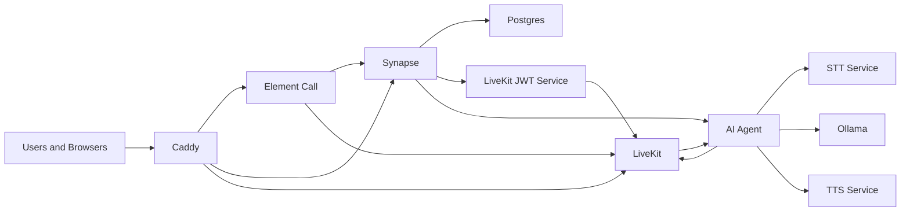

# Matrix homeserver  + LiveKit AI Assistant (CPU-Only)

A self-hosted Matrix communications stack featuring VoIP and an in-call AI assistant. This entire stack is optimized to run on **CPU only**, requiring no GPU.

## 🚀 Features

- **Matrix Homeserver**: Powered by [Synapse](https://github.com/element-hq/synapse).
- **VoIP / Media**: [LiveKit](https://livekit.io/) SFU for high-performance audio/video.
- **Frontend**: Use [Element Call](https://github.com/vector-im/element-call)
- **AI Brain**: [Ollama](https://ollama.com/) running `qwen2.5:3b` (or other small models suited for CPU only hosting)
- **Real-time STT**: [faster-whisper](https://github.com/SYSTRAN/faster-whisper) + [whisper-streaming](https://github.com/ufal/whisper_streaming) for low-latency transcription.
- **Natural TTS**: [Kokoro-82M](https://github.com/remsky/kokoro-fastapi-cpu) for high-quality, fast speech synthesis.
- **Orchestration**: Docker Compose with Caddy as a reverse proxy for automatic TLS.

---

## 🏗️ Architecture



1.  **Caddy**: Handles HTTPS and routes traffic to Synapse, LiveKit, and Element Call.
2.  **Synapse**: The Matrix homeserver, managing users, rooms, and VoIP state.
3.  **LiveKit**: The SFU that handles the actual WebRTC media streams.
4.  **LiveKit-JWT-Service**: A bridge that validates Matrix tokens and issues LiveKit tokens.
5.  **STT Service**: A WebSocket service that streams PCM audio to Faster-Whisper.
6.  **TTS Service**: An OpenAI-compatible REST API for generating audio from text.
7.  **AI Agent**: The orchestrator that joins calls, runs VAD, manages the LLM context, and handles audio I/O.

---

## 📋 Prerequisites

- **Hardware**: Minimum 4 vCPU / 8 GB RAM / 40 GB Disk.
- **Domain**: A domain name (e.g., `example.com`) with DNS A records for:
  - `matrix.example.com`
  - `livekit.example.com`
  - `call.example.com`
- **Software**: Docker and Docker Compose v2.

---

## 🛠️ Setup & Installation

### 1. Clone & Scaffold
```bash
git clone <your-repo-url>
cd matrix-livekit-assistant
```

### 2. Environment Configuration
Copy the example environment file and fill in your details:
```bash
cp .env.example .env
```
Key variables to set:
- `DOMAIN`: Your base domain (e.g., `example.com`).
- `POSTGRES_PASSWORD`: A secure password for the database.
- `LIVEKIT_KEYS`: Keys for LiveKit (any secure string). Needs to be in the format of 'devkey: devsecret'
- `ASSISTANT_USER_ID`: The Matrix ID for the AI assistant (e.g., `@assistant:example.com`).

### 3. Generate Synapse Signing Key
```bash
# Generate the key using the Synapse image
docker run --rm -v "$(pwd)/synapse:/data" \
  -e SYNAPSE_SERVER_NAME=marwenselfhosted.uk \
  -e SYNAPSE_REPORT_STATS=no \
  matrixdotorg/synapse:v1.121.1 generate

# Rename it to the expected generic name if necessary
mv synapse/marwenselfhosted.uk.signing.key synapse/signing.key
```

### 4. Pull and Build
```bash
docker compose pull
docker compose build
```

### 5. Initialize Models
Start Ollama and the STT service to download required weights:
```bash
# Start Ollama and pull the default model
docker compose up -d ollama
docker compose exec ollama ollama pull qwen2.5:3b

# Start STT service (first run downloads ~1.5GB of Whisper weights)
docker compose up -d stt-service
docker compose logs -f stt-service
```

### 6. Start Everything
```bash
docker compose up -d
```

### 7. User Registration
Register an admin user and the assistant user:
```bash
# Admin user
docker compose exec synapse register_new_matrix_user -c /data/homeserver.rendered.yaml http://localhost:8008

# Assistant user
docker compose exec synapse register_new_matrix_user -c /data/homeserver.rendered.yaml http://localhost:8008 --user assistant --password your_password --no-admin 
```

---

## 📞 Usage

1.  Log in to your Matrix server via Element or Element Call (`call.yourdomain.com`).
2.  Create a room and invite `@assistant:yourdomain.com` and other users.
3.  Start a voice call.
4.  The assistant will automatically join. Simply speak to it, and it will respond!

---

## 🔧 Troubleshooting

- **STT Latency**: If the response is slow, check `STT_THREADS` in `.env`. Increasing it might help if you have more cores.
- **OOM Errors**: If Ollama crashes, ensure you have enough RAM. You can switch to `qwen2.5:1.5b` for a smaller footprint.
- **Audio Issues**: Ensure UDP ports `50400-50500` are open in your VPS firewall for WebRTC traffic.
- **Caddy TLS**: If TLS fails, verify your DNS records and ensure ports 80/443 are reachable.

---

## 📜 License
MIT
